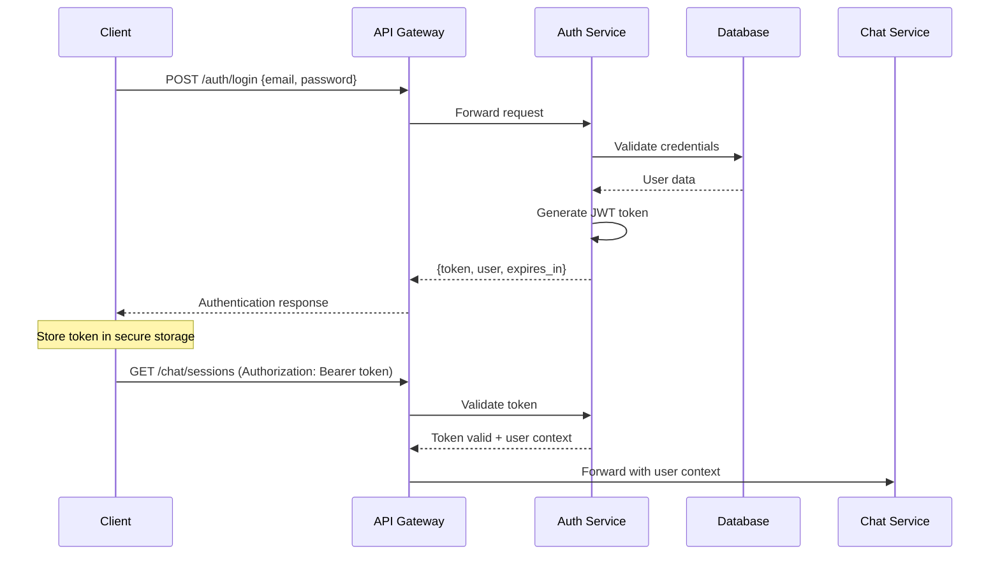
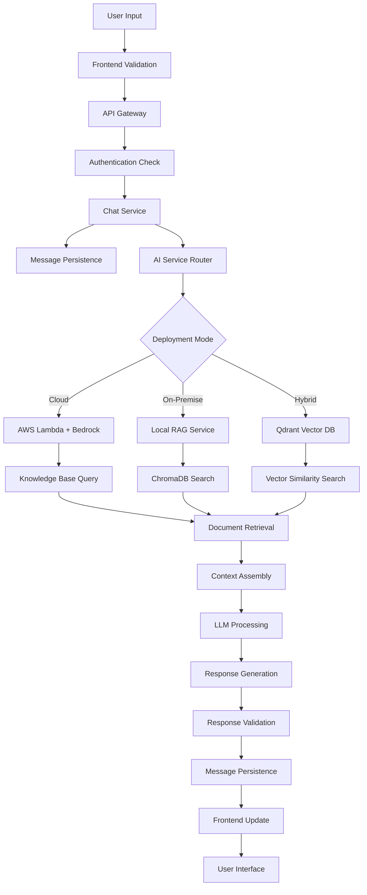
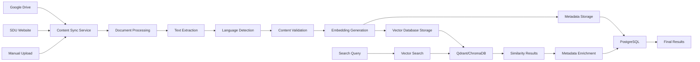
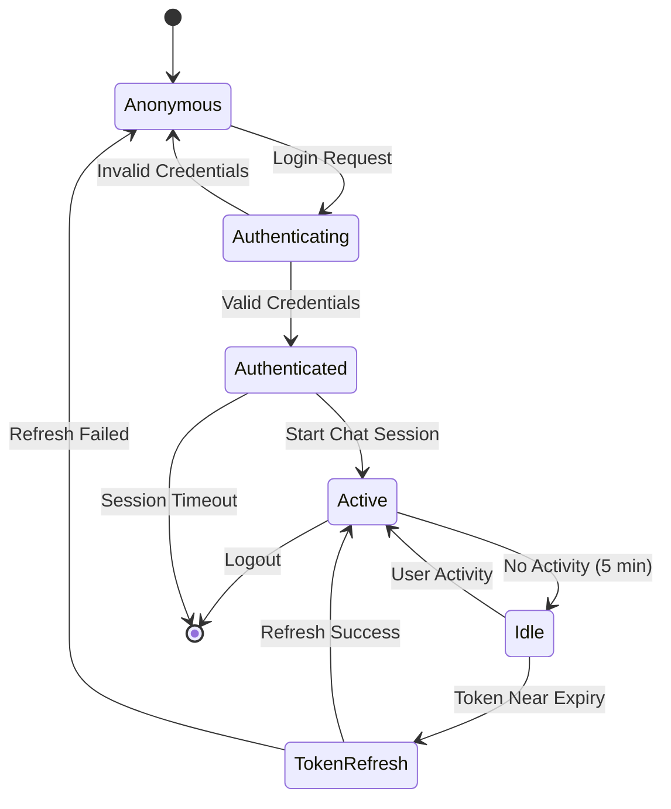

# System Architecture Document
# SDU AI Chatbot Platform

**Document Version:** 1.0  
**Last Updated:** December 19, 2025  
**Document Owner:** SDU ChatBot Development Team  
**Technical Lead:** Meraliyev Meraryslan, Head of Information Systems Department

---

## 1. Overall Architecture Style

The SDU AI Chatbot Platform follows a **Distributed Microservices Architecture** with multiple deployment options to ensure flexibility, scalability, and resilience. The system is designed as a hybrid cloud-on-premise solution that can operate in three distinct modes:

### Architecture Patterns
- **Client-Server Architecture**: Clear separation between presentation and business logic layers
- **Microservices Pattern**: Independent, loosely-coupled services with specific responsibilities
- **Event-Driven Architecture**: Asynchronous communication between services
- **API Gateway Pattern**: Centralized entry point for all client requests
- **Repository Pattern**: Abstracted data access layer
- **RAG (Retrieval-Augmented Generation) Pattern**: AI-powered information retrieval and response generation

### Deployment Models
1. **Cloud-First (AWS)**: Serverless functions with managed services
2. **On-Premise**: Self-hosted with Docker containerization
3. **Hybrid**: Frontend on cloud, backend on-premise, AI services distributed

---

## 2. System Components Diagram

```
    ┌─────────────────────────────────────────────────────────────┐
    │                         CLIENT LAYER                        │
    ├─────────────────┬─────────────────┬─────────────────────────┤
    │   Web Browser   │  Mobile App     │    Admin Dashboard      │
    │   (React SPA)   │  (IOS)          │     (React Admin)       │
    └─────────────────┴─────────────────┴─────────────────────────┘
                                    │
                                    ▼
┌─────────────────────────────────────────────────────────────────────────────────┐
│                              API GATEWAY LAYER                                  │
├─────────────────────────────────────────────────────────────────────────────────┤
│  • Load Balancing          • Rate Limiting         • Authentication             │
│  • Request Routing         • CORS Handling         • SSL Termination            │
└─────────────────────────────────────────────────────────────────────────────────┘
                                    │
                                    ▼
┌───────────────────────────────────────────────────────────────────────────────┐
│                            APPLICATION LAYER                                  │
├─────────────────┬─────────────────┬─────────────────┬─────────────────────────┤
│  Authentication │   Chat Service  │   AI Service    │   Content Service       │
│    Service      │   (Spring Boot) │   (Multiple)    │   (Document Mgmt)       │
│  (JWT + OAuth)  │                 │                 │                         │
└─────────────────┴─────────────────┴─────────────────┴─────────────────────────┘
                                    │
                                    ▼
┌───────────────────────────────────────────────────────────────────────────────┐
│                              AI PROCESSING LAYER                              │
├─────────────────┬─────────────────┬─────────────────┬─────────────────────────┤
│   AWS Lambda    │  Local RAG      │  Qdrant Vector  │   Telegram Bot AI       │
│   (Bedrock)     │   Service       │    Database     │      Integration        │
│                 │  (LangChain)    │   (FastAPI)     │                         │
└─────────────────┴─────────────────┴─────────────────┴─────────────────────────┘
                                    │
                                    ▼
┌───────────────────────────────────────────────────────────────────────────────┐
│                               DATA LAYER                                      │
├─────────────────┬─────────────────┬─────────────────┬─────────────────────────┤
│   PostgreSQL    │   DynamoDB      │   ChromaDB      │    Google Drive         │
│  (User Data)    │ (Chat History)  │  (Embeddings)   │   (Knowledge Base)      │
│                 │                 │                 │                         │
└─────────────────┴─────────────────┴─────────────────┴─────────────────────────┘
```

---

## 3. Component Descriptions

### Client Layer Components

**Web Browser (React SPA)**
- **Purpose**: Primary user interface for desktop and mobile web access
- **Technology**: React 19.1.0 with TypeScript, Vite build system
- **Responsibilities**: User authentication, chat interface, conversation management, responsive design
- **Key Features**: Real-time messaging, conversation history, multilingual support, admin dashboard

**Mobile Application (Future)**
- **Purpose**: Native mobile experience for iOS and Android
- **Technology**: React Native (planned)
- **Responsibilities**: Push notifications, offline capabilities, mobile-optimized UI
- **Integration**: Shared API endpoints with web application

**Telegram Bot Interface**
- **Purpose**: Alternative access channel through Telegram messaging
- **Technology**: aiogram 3.20 (Python)
- **Responsibilities**: Menu navigation, multilingual support, user management, AI integration
- **Key Features**: Interactive keyboards, payment integration, administrative commands

### API Gateway Layer

**Load Balancer & API Gateway**
- **Purpose**: Single entry point for all client requests
- **Technology**: Nginx (on-premise) / AWS API Gateway (cloud)
- **Responsibilities**: Request routing, rate limiting, SSL termination, CORS handling
- **Features**: Health checks, failover, request/response transformation

### Application Layer Components

**Authentication Service**
- **Purpose**: User identity management and authorization
- **Technology**: Spring Security with JWT, Google OAuth 2.0
- **Responsibilities**: User login/logout, token generation/validation, role-based access control
- **Database**: PostgreSQL for user profiles and permissions
- **Security**: Multi-factor authentication support, session management

**Chat Service (Spring Boot Backend)**
- **Purpose**: Core business logic for chat operations
- **Technology**: Java 21, Spring Boot 3.5.0, Spring Data JPA
- **Responsibilities**: Conversation management, user session handling, API orchestration
- **Features**: RESTful APIs, conversation persistence, user preference management
- **Integration**: Connects to AI services, manages chat history, handles file uploads

**AI Service Layer (Multiple Implementations)**
- **AWS Lambda Service**: Serverless AI processing with Amazon Bedrock
- **Local RAG Service**: On-premise AI with LangChain and OpenAI GPT-4
- **Qdrant RAG Service**: Vector database for semantic search
- **Responsibilities**: Natural language processing, document retrieval, response generation

**Content Management Service**
- **Purpose**: Knowledge base management and synchronization
- **Technology**: Python with Google Drive API, web scraping tools
- **Responsibilities**: Document ingestion, content updates, metadata management
- **Features**: Real-time synchronization, version control, content validation

### AI Processing Layer Components

**AWS Lambda Chatbot Service**
- **Technology**: Python 3.8+, Amazon Bedrock, Claude 3.7 Sonnet
- **Purpose**: Cloud-based AI processing with managed services
- **Features**: Auto-scaling, pay-per-use, integrated with AWS ecosystem
- **Data Sources**: Amazon S3 knowledge base, DynamoDB chat history

**Local RAG Service**
- **Technology**: Python 3.12, LangChain, OpenAI GPT-4, ChromaDB
- **Purpose**: On-premise AI processing with full data control
- **Features**: Custom model fine-tuning, local data processing, offline capabilities
- **Integration**: PostgreSQL for structured data, ChromaDB for vector embeddings

**Qdrant Vector Database Service**
- **Technology**: Python 3.13, FastAPI, Qdrant, sentence-transformers
- **Purpose**: High-performance semantic search and document retrieval
- **Features**: Multilingual embeddings, real-time indexing, similarity search
- **Scalability**: Horizontal scaling, distributed vector storage

### Data Layer Components

**PostgreSQL Database**
- **Purpose**: Primary relational database for structured data
- **Schema**: Users, conversations, permissions, audit logs, system configuration
- **Features**: ACID compliance, full-text search, JSON support, replication
- **Backup**: Automated backups, point-in-time recovery

**DynamoDB (AWS)**
- **Purpose**: NoSQL database for chat history and session data
- **Features**: Auto-scaling, global tables, stream processing
- **Use Case**: High-throughput conversation storage, real-time access patterns

**ChromaDB / Qdrant**
- **Purpose**: Vector databases for document embeddings and semantic search
- **Features**: Similarity search, metadata filtering, real-time updates
- **Integration**: Synchronized with knowledge base updates

**Google Drive Integration**
- **Purpose**: External knowledge base and document repository
- **Features**: Real-time synchronization, version tracking, collaborative editing
- **Security**: OAuth 2.0 authentication, encrypted data transfer

---

## 4. Technology Selection Justification

### Frontend Technologies

**React 19.1.0 + TypeScript**
- **Justification**: Modern, component-based architecture with strong typing
- **Benefits**: Large ecosystem, excellent performance, strong community support
- **Trade-offs**: Learning curve for new developers, build complexity

**Vite 6.3.5**
- **Justification**: Fast development server and optimized production builds
- **Benefits**: Hot module replacement, tree shaking, modern ES modules
- **Alternative Considered**: Create React App (rejected due to performance)

**Redux Toolkit + RTK Query**
- **Justification**: Predictable state management with built-in API caching
- **Benefits**: DevTools integration, optimistic updates, automatic re-fetching
- **Alternative Considered**: Context API (insufficient for complex state)

### Backend Technologies

**Java 21 + Spring Boot 3.5.0**
- **Justification**: Enterprise-grade framework with excellent ecosystem
- **Benefits**: Dependency injection, auto-configuration, production-ready features
- **Trade-offs**: Higher memory usage, longer startup times
- **Alternative Considered**: Node.js (rejected due to team expertise)

**PostgreSQL 15**
- **Justification**: Robust relational database with JSON support
- **Benefits**: ACID compliance, full-text search, excellent performance
- **Trade-offs**: Vertical scaling limitations
- **Alternative Considered**: MongoDB (rejected due to consistency requirements)

### AI Technologies

**Amazon Bedrock + Claude 3.7 Sonnet**
- **Justification**: Managed AI service with state-of-the-art language models
- **Benefits**: No infrastructure management, automatic scaling, latest models
- **Trade-offs**: Vendor lock-in, usage costs, limited customization

**LangChain + OpenAI GPT-4**
- **Justification**: Flexible framework for building AI applications
- **Benefits**: Model agnostic, extensive tooling, active development
- **Trade-offs**: Complexity, dependency management, API costs

**Qdrant Vector Database**
- **Justification**: High-performance vector search with multilingual support
- **Benefits**: Fast similarity search, metadata filtering, horizontal scaling
- **Alternative Considered**: Pinecone (rejected due to cost and data locality)

---

## 5. Database Structure and Schema

### PostgreSQL Schema (Primary Database)

```sql
-- Users and Authentication
CREATE TABLE users (
    id SERIAL PRIMARY KEY,
    email VARCHAR(255) UNIQUE NOT NULL,
    username VARCHAR(100) UNIQUE,
    password_hash VARCHAR(255),
    role VARCHAR(50) DEFAULT 'student',
    preferred_language VARCHAR(10) DEFAULT 'en',
    is_active BOOLEAN DEFAULT true,
    created_at TIMESTAMP DEFAULT CURRENT_TIMESTAMP,
    updated_at TIMESTAMP DEFAULT CURRENT_TIMESTAMP
);

-- Chat Sessions
CREATE TABLE chat_sessions (
    id UUID PRIMARY KEY DEFAULT gen_random_uuid(),
    user_id INTEGER REFERENCES users(id),
    title VARCHAR(255),
    language VARCHAR(10) DEFAULT 'en',
    is_active BOOLEAN DEFAULT true,
    created_at TIMESTAMP DEFAULT CURRENT_TIMESTAMP,
    updated_at TIMESTAMP DEFAULT CURRENT_TIMESTAMP
);

-- Messages
CREATE TABLE messages (
    id UUID PRIMARY KEY DEFAULT gen_random_uuid(),
    session_id UUID REFERENCES chat_sessions(id),
    content TEXT NOT NULL,
    message_type VARCHAR(20) CHECK (message_type IN ('user', 'assistant', 'system')),
    metadata JSONB,
    sources JSONB,
    tokens_used INTEGER,
    cost_usd DECIMAL(10,6),
    created_at TIMESTAMP DEFAULT CURRENT_TIMESTAMP
);

-- Knowledge Base Documents
CREATE TABLE documents (
    id UUID PRIMARY KEY DEFAULT gen_random_uuid(),
    title VARCHAR(500) NOT NULL,
    content TEXT NOT NULL,
    source_url VARCHAR(1000),
    document_type VARCHAR(50),
    language VARCHAR(10),
    metadata JSONB,
    embedding_id VARCHAR(255),
    last_updated TIMESTAMP DEFAULT CURRENT_TIMESTAMP,
    created_at TIMESTAMP DEFAULT CURRENT_TIMESTAMP
);

-- User Preferences
CREATE TABLE user_preferences (
    user_id INTEGER PRIMARY KEY REFERENCES users(id),
    theme VARCHAR(20) DEFAULT 'light',
    notifications_enabled BOOLEAN DEFAULT true,
    preferred_ai_model VARCHAR(100),
    custom_settings JSONB,
    updated_at TIMESTAMP DEFAULT CURRENT_TIMESTAMP
);

-- Audit Log
CREATE TABLE audit_log (
    id SERIAL PRIMARY KEY,
    user_id INTEGER REFERENCES users(id),
    action VARCHAR(100) NOT NULL,
    resource_type VARCHAR(50),
    resource_id VARCHAR(255),
    details JSONB,
    ip_address INET,
    user_agent TEXT,
    created_at TIMESTAMP DEFAULT CURRENT_TIMESTAMP
);

-- Indexes for Performance
CREATE INDEX idx_messages_session_id ON messages(session_id);
CREATE INDEX idx_messages_created_at ON messages(created_at);
CREATE INDEX idx_documents_language ON documents(language);
CREATE INDEX idx_documents_type ON documents(document_type);
CREATE INDEX idx_users_email ON users(email);
CREATE INDEX idx_chat_sessions_user_id ON chat_sessions(user_id);
```

### DynamoDB Schema (AWS Chat History)

```json
{
  "TableName": "sdu-bot-chat-history",
  "KeySchema": [
    {
      "AttributeName": "chat_id",
      "KeyType": "HASH"
    },
    {
      "AttributeName": "timestamp",
      "KeyType": "RANGE"
    }
  ],
  "AttributeDefinitions": [
    {
      "AttributeName": "chat_id",
      "AttributeType": "S"
    },
    {
      "AttributeName": "timestamp",
      "AttributeType": "N"
    }
  ],
  "GlobalSecondaryIndexes": [
    {
      "IndexName": "user-id-index",
      "KeySchema": [
        {
          "AttributeName": "user_id",
          "KeyType": "HASH"
        }
      ]
    }
  ]
}
```

### Vector Database Schema (Qdrant)

```python
# Collection Configuration
collection_config = {
    "vectors": {
        "size": 384,  # sentence-transformers embedding dimension
        "distance": "Cosine"
    },
    "payload_schema": {
        "title": "keyword",
        "content": "text",
        "source_url": "keyword",
        "language": "keyword",
        "document_type": "keyword",
        "created_at": "datetime",
        "metadata": "object"
    }
}
```

---

## 6. Frontend-Backend Interaction

### Communication Patterns

**RESTful API Communication**
```typescript
// Frontend API Service (RTK Query)
export const chatApi = createApi({
  reducerPath: 'chatApi',
  baseQuery: fetchBaseQuery({
    baseUrl: '/api/v1',
    prepareHeaders: (headers, { getState }) => {
      const token = selectAuthToken(getState());
      if (token) {
        headers.set('authorization', `Bearer ${token}`);
      }
      return headers;
    },
  }),
  tagTypes: ['Chat', 'Message', 'User'],
  endpoints: (builder) => ({
    sendMessage: builder.mutation({
      query: ({ sessionId, message }) => ({
        url: `/chat/${sessionId}/messages`,
        method: 'POST',
        body: { content: message, timestamp: Date.now() }
      }),
      invalidatesTags: ['Message']
    }),
    getChatHistory: builder.query({
      query: (sessionId) => `/chat/${sessionId}/messages`,
      providesTags: ['Message']
    })
  })
});
```

**WebSocket Integration (Future)**
```typescript
// Real-time message streaming
const useWebSocket = (sessionId: string) => {
  const [socket, setSocket] = useState<WebSocket | null>(null);
  
  useEffect(() => {
    const ws = new WebSocket(`wss://api.sdu.edu.kz/ws/chat/${sessionId}`);
    ws.onmessage = (event) => {
      const message = JSON.parse(event.data);
      dispatch(addMessage(message));
    };
    setSocket(ws);
    
    return () => ws.close();
  }, [sessionId]);
};
```

### Authentication Flow



### Error Handling Strategy

```typescript
// Global Error Handler
const errorHandler = (error: any, api: any) => {
  if (error.status === 401) {
    // Token expired - refresh or redirect to login
    api.dispatch(refreshToken());
  } else if (error.status === 429) {
    // Rate limited - show user-friendly message
    api.dispatch(showNotification({
      type: 'warning',
      message: 'Too many requests. Please wait a moment.'
    }));
  } else if (error.status >= 500) {
    // Server error - show generic error
    api.dispatch(showNotification({
      type: 'error',
      message: 'Service temporarily unavailable. Please try again.'
    }));
  }
};
```

---

## 7. Data Flow Through the System

### Message Processing Flow



### Document Ingestion Flow



### User Session Management



---

## 8. Potential Future Extensions

### Scalability Enhancements

**Microservices Decomposition**
- Split monolithic backend into domain-specific services
- Implement service mesh (Istio) for inter-service communication
- Add distributed tracing (Jaeger) for observability
- Implement circuit breakers for fault tolerance

**Database Scaling**
```sql
-- Read Replicas for Query Distribution
CREATE REPLICA DATABASE sdu_chat_read_replica;

-- Horizontal Partitioning for Large Tables
CREATE TABLE messages_2024 PARTITION OF messages 
FOR VALUES FROM ('2024-01-01') TO ('2025-01-01');

-- Caching Layer Integration
REDIS_CONFIG = {
    "host": "redis-cluster",
    "port": 6379,
    "db": 0,
    "ttl": 3600  # 1 hour cache
}
```

### Advanced AI Capabilities

**Multi-Modal AI Integration**
```python
# Voice Processing Pipeline
class VoiceProcessor:
    def __init__(self):
        self.speech_to_text = WhisperModel()
        self.text_to_speech = ElevenLabsAPI()
        self.emotion_detector = EmotionAnalyzer()
    
    async def process_voice_input(self, audio_data):
        text = await self.speech_to_text.transcribe(audio_data)
        emotion = await self.emotion_detector.analyze(audio_data)
        response = await self.chat_service.process_message(text, emotion)
        audio_response = await self.text_to_speech.synthesize(response)
        return audio_response
```

**Personalization Engine**
```python
# User Behavior Analysis
class PersonalizationEngine:
    def __init__(self):
        self.user_profiler = UserProfiler()
        self.recommendation_model = CollaborativeFilter()
        self.content_ranker = ContentRanker()
    
    def personalize_response(self, user_id, query, base_response):
        user_profile = self.user_profiler.get_profile(user_id)
        personalized_content = self.content_ranker.rank(
            base_response, user_profile
        )
        recommendations = self.recommendation_model.suggest(
            user_id, query
        )
        return {
            "response": personalized_content,
            "suggestions": recommendations,
            "confidence": self.calculate_confidence(user_profile, query)
        }
```

### Integration Expansions

**Learning Management System (LMS) Integration**
```typescript
// LMS API Integration
interface LMSIntegration {
  getCourseSchedule(studentId: string): Promise<Course[]>;
  getAssignments(courseId: string): Promise<Assignment[]>;
  getGrades(studentId: string): Promise<Grade[]>;
  submitAssignment(assignmentId: string, file: File): Promise<boolean>;
}

class MoodleIntegration implements LMSIntegration {
  constructor(private apiKey: string, private baseUrl: string) {}
  
  async getCourseSchedule(studentId: string): Promise<Course[]> {
    const response = await fetch(`${this.baseUrl}/webservice/rest/server.php`, {
      method: 'POST',
      headers: { 'Authorization': `Bearer ${this.apiKey}` },
      body: new URLSearchParams({
        wstoken: this.apiKey,
        wsfunction: 'core_enrol_get_users_courses',
        userid: studentId,
        moodlewsrestformat: 'json'
      })
    });
    return response.json();
  }
}
```

**IoT and Smart Campus Integration**
```python
# Smart Campus Integration
class SmartCampusIntegration:
    def __init__(self):
        self.room_sensors = RoomSensorAPI()
        self.parking_system = ParkingAPI()
        self.cafeteria_system = CafeteriaAPI()
    
    async def get_room_availability(self, building: str, floor: int):
        sensors_data = await self.room_sensors.get_occupancy(building, floor)
        available_rooms = [
            room for room in sensors_data 
            if room['occupancy'] < room['capacity'] * 0.8
        ]
        return available_rooms
    
    async def get_parking_status(self):
        return await self.parking_system.get_available_spots()
    
    async def get_cafeteria_menu(self, date: str):
        return await self.cafeteria_system.get_daily_menu(date)
```

### Performance Optimizations

**Edge Computing Deployment**
```yaml
# Edge Node Configuration
apiVersion: v1
kind: ConfigMap
metadata:
  name: edge-config
data:
  edge-locations: |
    - name: "almaty-edge"
      location: "Almaty, Kazakhstan"
      services: ["chat-api", "static-content"]
      capacity: "1000 concurrent users"
    - name: "astana-edge"
      location: "Astana, Kazakhstan"
      services: ["chat-api", "document-search"]
      capacity: "500 concurrent users"
```

**Advanced Caching Strategy**
```python
# Multi-Level Caching
class CacheManager:
    def __init__(self):
        self.l1_cache = InMemoryCache(ttl=300)  # 5 minutes
        self.l2_cache = RedisCache(ttl=3600)    # 1 hour
        self.l3_cache = DatabaseCache(ttl=86400) # 24 hours
    
    async def get_cached_response(self, query_hash: str):
        # Try L1 cache first
        result = await self.l1_cache.get(query_hash)
        if result:
            return result
        
        # Try L2 cache
        result = await self.l2_cache.get(query_hash)
        if result:
            await self.l1_cache.set(query_hash, result)
            return result
        
        # Try L3 cache
        result = await self.l3_cache.get(query_hash)
        if result:
            await self.l2_cache.set(query_hash, result)
            await self.l1_cache.set(query_hash, result)
            return result
        
        return None
```

### Security Enhancements

**Zero Trust Architecture**
```python
# Zero Trust Security Model
class ZeroTrustValidator:
    def __init__(self):
        self.device_fingerprinter = DeviceFingerprinter()
        self.behavior_analyzer = BehaviorAnalyzer()
        self.risk_assessor = RiskAssessor()
    
    async def validate_request(self, request, user_context):
        device_trust = await self.device_fingerprinter.assess(request)
        behavior_trust = await self.behavior_analyzer.assess(user_context)
        risk_score = await self.risk_assessor.calculate(
            device_trust, behavior_trust, request
        )
        
        if risk_score > 0.8:
            return {"allow": False, "reason": "High risk detected"}
        elif risk_score > 0.5:
            return {"allow": True, "require_mfa": True}
        else:
            return {"allow": True, "require_mfa": False}
```

---

**Document Approval:**
- **Technical Architecture Review:** Meraliyev Meraryslan, Head of Information Systems Department
- **Implementation Approval:** SDU ChatBot Development Team
- **Next Architecture Review:** June 2026